# Schengen 90/180 Calculator

**The most accurate, offline-first app to track your Schengen visa days and allowed stay.**

💻 **Schengen Calculator Online:** Try our free [Schengen Calculator Online](https://schengen.live/schengen-calculator.html) directly in your web browser. It features the exact same timezone-safe, DST-compliant calculation engine and saves your travel checklist locally in your browser's storage without requiring an account.

  
  
  
  

---

## 🌍 The Problem: Why Schengen Tracking is Hard

Calculating the 90/180 rule manually is surprisingly complex. The 180-day window is a "rolling" window, meaning it shifts forward every single day. Days you spent in the Schengen area months ago might suddenly fall out of the window, completely changing your current allowance. A simple spreadsheet miscalculation can lead to overstays, hefty fines, or future visa denials.

## ✨ Key Features

*   **Works Fully Offline:** Track your trips anywhere, no internet required.
*   **Privacy-First by Default:** Tracking works without an account and your data stays on your device. Optional paid extras (cloud sync, profile sharing, AI assistant) require signing in.
*   **No Ads:** A clean, premium, and distraction-free experience.
*   **Multiple Profiles:** Manage tracking for yourself, your family, or your clients effortlessly.
*   **Calendar-Based Tracking:** Easily select and visualize your entry and exit dates.
*   **Absolute Accuracy:** Flawlessly handles Daylight Saving Time (DST), timezones, and complex travel histories.

## 🧮 How the 90/180 Rule Works

The official rule states that you can stay in the Schengen Area for a maximum of **90 days within any rolling 180-day period**.

**Example:** If you plan to be in the Schengen Area today, the calculator looks back exactly 180 days. Any days spent in Schengen during that period are subtracted from your 90-day allowance. Tomorrow, the 180-day window shifts forward by one day, recalculating your allowance dynamically.

## ⚠️ Why Most Calculators Are Wrong

Many simple Schengen calculators and spreadsheets fail when dealing with real-world edge cases:
*   **Daylight Saving Time (DST):** Time changes can cause simple 24-hour algorithms to miscount days.
*   **Timezones:** Entering and exiting across different timezones often leads to off-by-one errors.
*   **Overlapping Trips:** Logging continuous or overlapping dates breaks basic math logic.

## 🛡️ Why This App is Reliable

Unlike other Schengen calculators, we've built a robust calculation engine that strictly counts calendar days according to the official Schengen Border Code. Our extensive automated test suite ensures that DST changes, timezone shifts, and overlapping trips never cause a dropped or overcounted day. You get precise, reliable results every time.

## 📱 Screenshots

  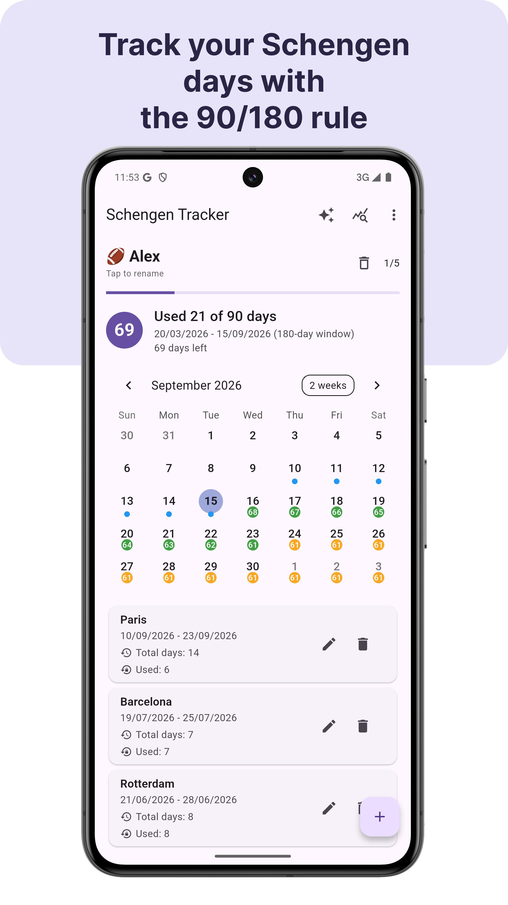
  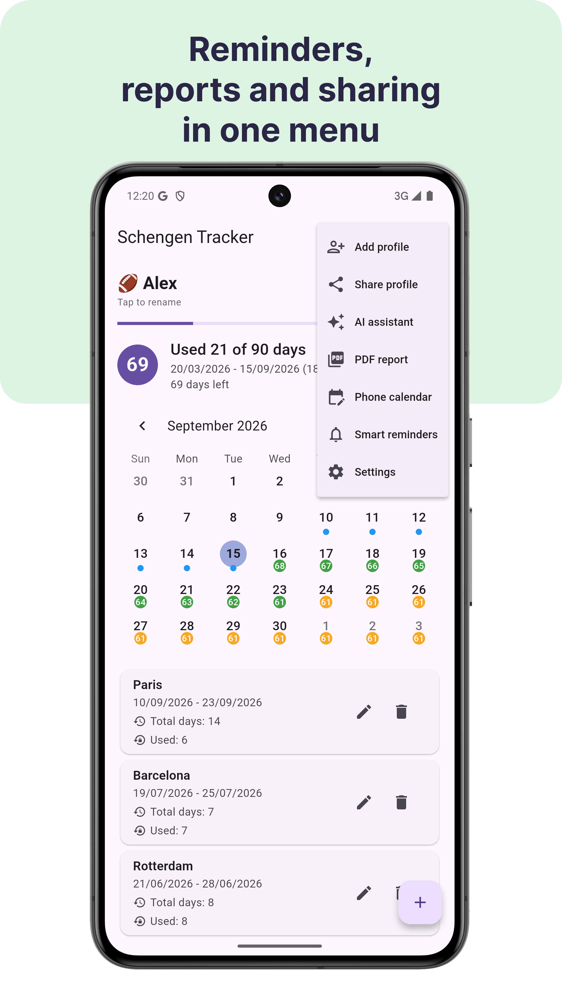
  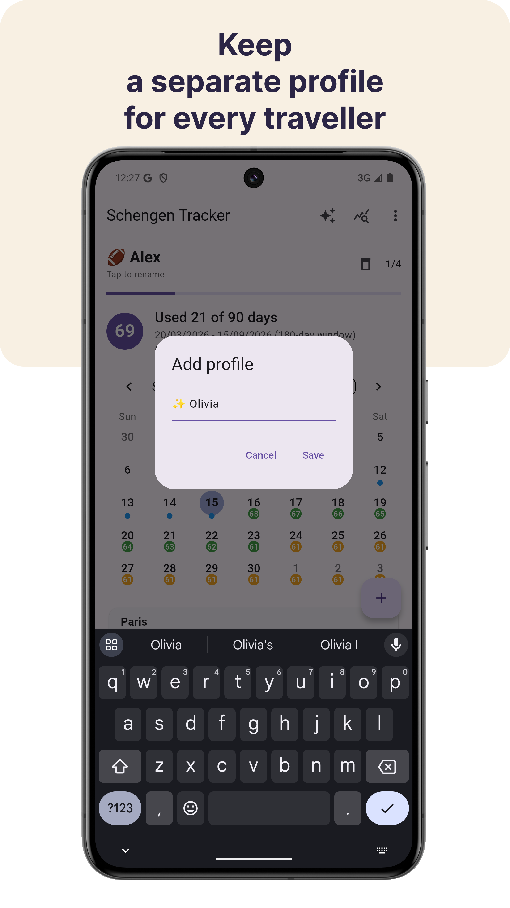
  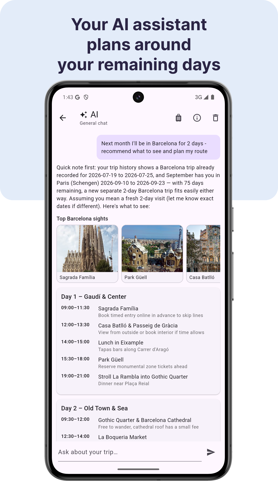
  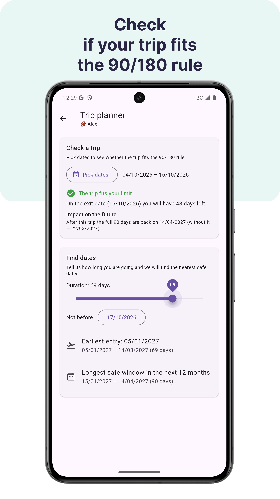
  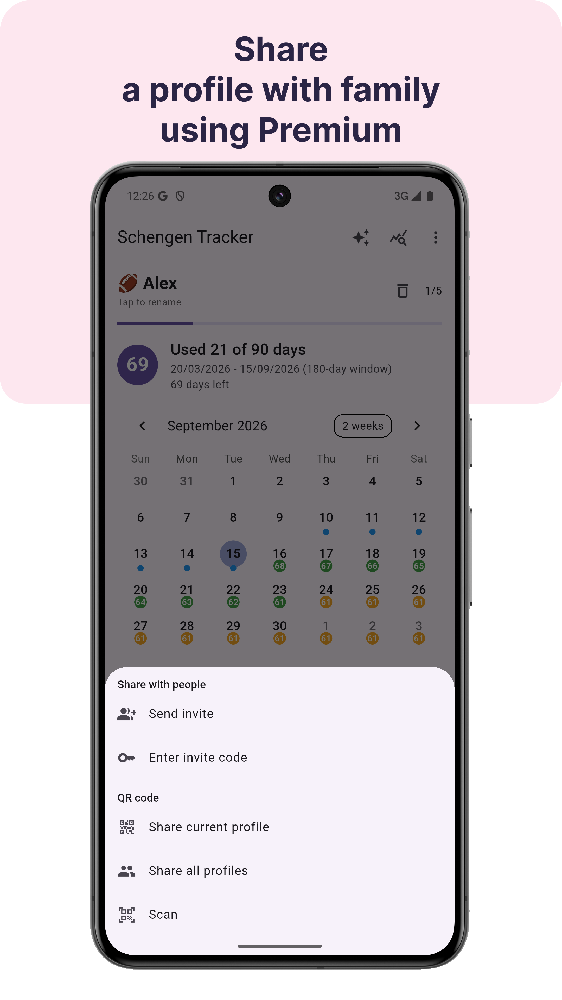
  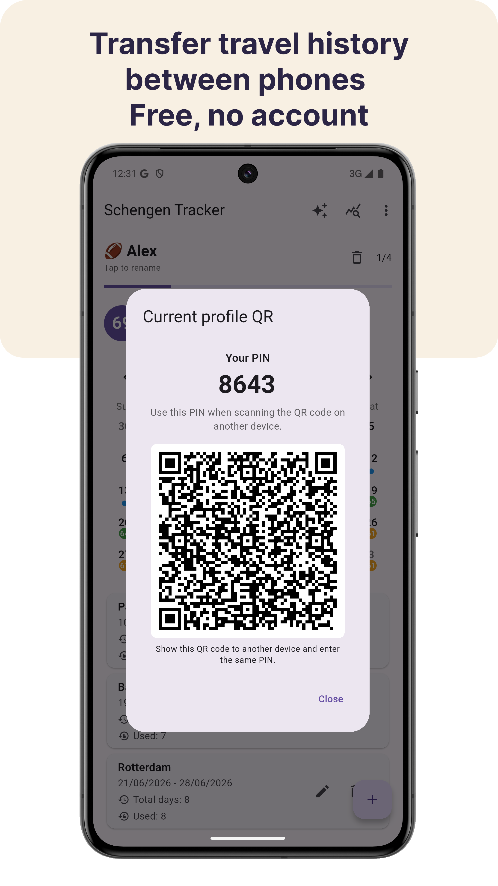
  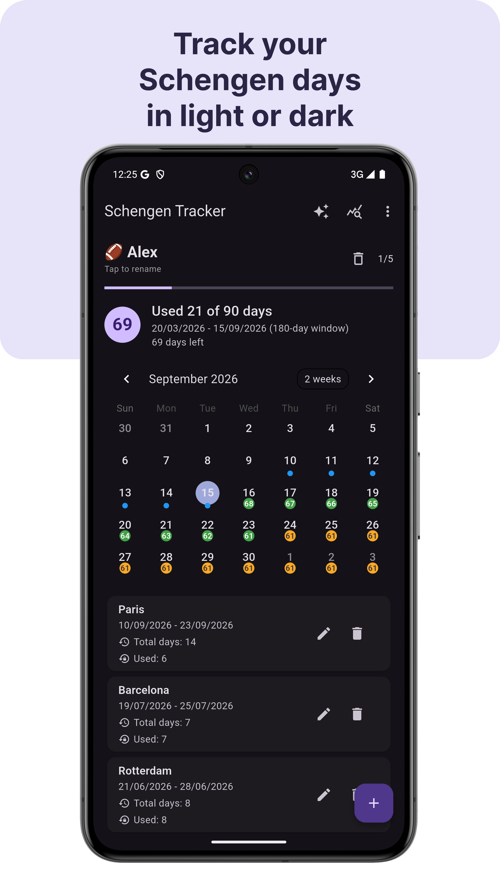
  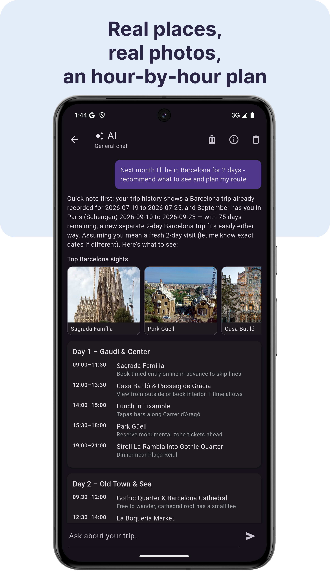
  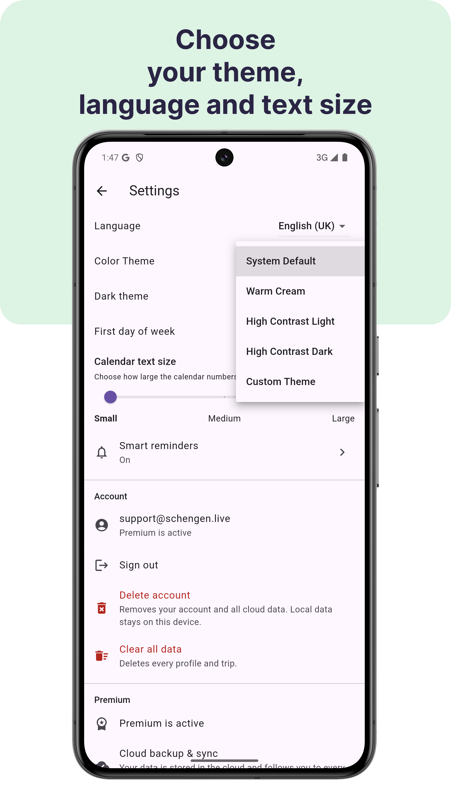
  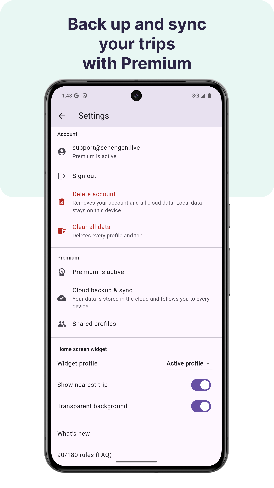

## 📥 Download & Try Online

*   **Try Web Version:** [Schengen Calculator Online](https://schengen.live/schengen-calculator.html)
*   **Android App:** [Get it on Google Play](https://play.google.com/store/apps/details?id=net.botolab.schengen)
*   **iOS App:** [Download on the App Store](https://apps.apple.com/app/schengen-calculator-for-90-180/id6766031029)

## 🎯 Who This App is For

*   **Travelers:** Exploring Europe on short-stay visas or visa-free regimes.
*   **Digital Nomads:** Jumping between Schengen and non-Schengen countries.
*   **Expats:** Navigating residency transitions or waiting for permits.
*   **Visa Holders:** Carefully tracking their legal allowed stay to avoid penalties.
*   **Immigration Consultants:** Managing the Schengen stay tracker records for multiple clients.

## 🔒 Privacy First

We believe your travel history is your business.
*   **No account needed to track your days** — signing in is only required for the optional paid features.
*   **Your travel data stays on your device by default** and is uploaded only if you turn on cloud sync or share a profile.
*   **No ads, and we never sell your data.** We use Firebase Analytics and Crashlytics for anonymous usage statistics and crash reports — see the [Privacy Policy](https://schengen.live/privacy.html).

## ❓ FAQ

**Q: What is the 90/180 Schengen rule?**
A: It restricts non-EU citizens to a maximum stay of 90 days within any rolling 180-day window inside the Schengen Area.

**Q: Does the app work offline?**
A: Yes! The app works 100% offline. You can use the Schengen calculator without any internet connection.

**Q: How do you calculate entry and exit days?**
A: According to the official Schengen rules, both the day of entry and the day of exit are counted as full days in the Schengen Area. Our app handles this automatically.

**Q: Can I track my family's trips too?**
A: Yes, the app supports multiple profiles so you can track the Schengen visa days of multiple people independently.

**Q: Are time changes and DST handled correctly?**
A: Absolutely. Our calculator engine uses strict calendar-inclusive logic, ensuring that Daylight Saving Time and timezone differences never result in an incorrect day count.

---
*Built to be the most reliable Schengen stay tracker available.*
